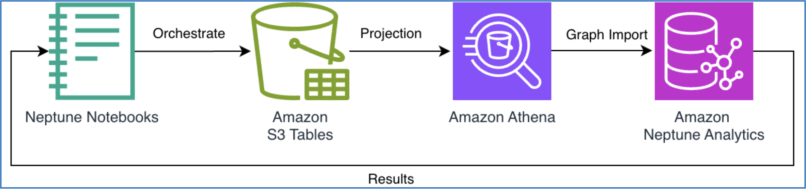
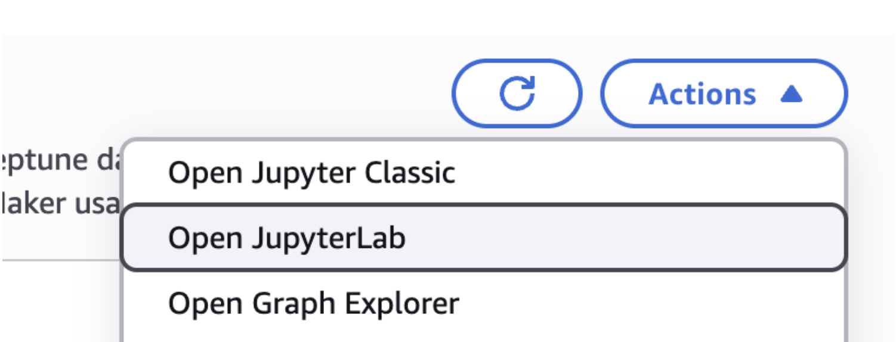
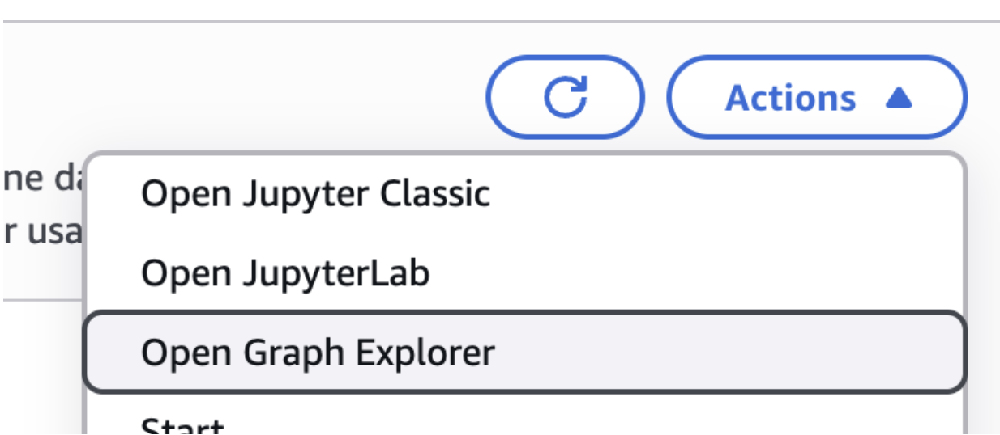
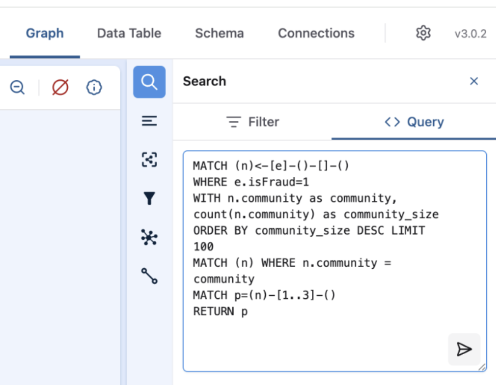
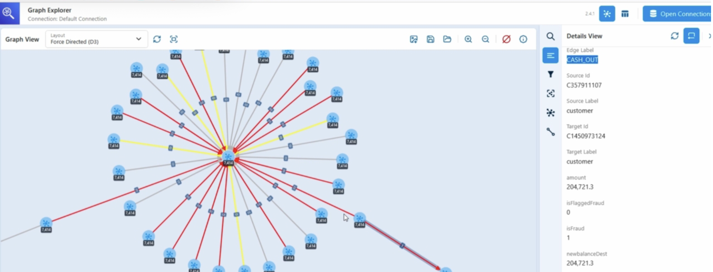

This post is a walkthrough of what nx-neptune does, feature by feature: defining a graph over your tables, provisioning compute on demand, running algorithms, visualizing the result, and exporting it back to the lake.

## What the library gives you

[nx-neptune](https://github.com/awslabs/nx-neptune) is an open-source Python library that packages **a pipeline that projects your tabular data into a graph on demand, runs the analytics, and writes the enriched result back to Iceberg**. Your tables stay put as the source of truth; the library handles the extract, transform, and load steps for you and spins the graph engine up only while you need it, so there's no permanent graph database to operate. Concretely, you can:

1. **Define a graph over existing tables.** Map tables to *nodes* and the events or associations that link them to *edges* using plain SQL — the library turns those definitions into the extract-and-transform step for you.
2. **Provision a graph engine on demand.** The library creates a graph view of your data and moves it into a graph engine behind the scenes, within an ephemeral session you can tear down when you're finished.
3. **Run graph queries and algorithms.** Execute [openCypher](https://opencypher.org/) queries for traversals, or use the [NetworkX](https://networkx.org/)-compatible interface to run community detection, centrality, pathfinding, and more.
4. **Write results back to the lake.** Export the enriched, algorithm-annotated graph back to your tables so the rest of your data ecosystem can use it.

Graphs shine wherever relationships matter — community structure and information flow in social networks, route optimization and bottleneck analysis in supply chains, vulnerability and threat mapping in security, and pattern discovery across financial services, knowledge management, and advertising. The walkthrough below uses a generic transaction-style dataset, but the same steps apply to any tabular data you can express as nodes and edges.

### Why Amazon Neptune Analytics?

Rather than reimplement graph algorithms itself, nx-neptune runs the analysis on [Amazon Neptune Analytics](https://docs.aws.amazon.com/neptune-analytics/latest/userguide/what-is-neptune-analytics.html) — a high-performance graph engine that runs built-in algorithms, vector search, and in-memory processing over graph data, scaling to datasets with tens of billions of relationships and returning results in seconds. The library provisions a Neptune Analytics instance on demand, loads your projected graph into it, runs the algorithm there, and tears the instance down when you're done. Because Neptune Analytics reads and writes graphs through Amazon services, the walkthrough connects to AWS resources such as Amazon S3, Amazon Athena, and Amazon Neptune throughout.

## How it fits together

The library orchestrates a small set of AWS services to project your data-lake tables into a graph and run analytics on that projection:



**Amazon S3 Tables** provide cost-effective storage for your data lake in Apache Iceberg format. S3 Tables offer the benefits of a data lake — scalability, durability, and low cost — while supporting atomicity, consistency, isolation, and durability (ACID) transactions and schema evolution. Your data stays in S3, where storage costs are minimal.

**Amazon Athena** acts as the query layer, letting you project tabular data into graph structures (nodes and edges) using standard SQL. Athena's serverless model means you only pay for the queries you run, with no infrastructure to manage.

**Amazon Neptune Analytics** provides the graph compute engine. You provision an instance on demand to run graph algorithms like community detection, centrality measures, and pathfinding, then suspend or delete it when the analysis is complete.

**Amazon Neptune Notebooks** give you a place to run the pipeline. For this walkthrough we deploy a Jupyter notebook connected to these services, with direct access to your Neptune Analytics graph and the Graph Explorer visualization tool.

The notebook workflow is straightforward:

1. Store your data in S3 Tables (Iceberg format).
2. Use Athena SQL queries to define graph views (answer "what is a node?" and "what is an edge?").
3. Load the view data into Neptune Analytics as nodes and edges.
4. Run graph algorithms using openCypher queries (or the [NetworkX](https://networkx.org/) Python library).
5. Export the annotated graph results back to S3 Tables.

**Key benefits:**

- **Cost-effective storage** — data lives in S3 at pennies per GB per month.
- **On-demand compute** — provision a powerful Neptune Analytics instance only when you need it, and only over the data you need.
- **Open-source tooling** — `nx-neptune` provides an interface for managing graph sessions, running openCypher queries, and a [NetworkX-compatible](https://networkx.org/) interface for graph analysis.

## Walkthrough

The complete implementation ships as an executable notebook, deployed by a CloudFormation template. It contains the following sections, which this walkthrough follows:

- **Setup/Configuration**: Define the environment variables that point at your resources.
- **Data Setup**: Land your source data and prepare the data lake.
- **Create a New / Get Existing Neptune Analytics**: Start a session with Neptune.
- **Import Data from S3**: Move your table data into the graph.
- **Execute an Algorithm**: Analyze the graph — here, community detection.
- **Export back to S3 Tables**: Write the annotated results into a new Iceberg table.

### Prepare resources and role

To follow along, you need the following **AWS services**:

- Amazon S3 (for data logging & storing intermediate state)
- Amazon S3 Tables (for Iceberg tables)
- Amazon Athena (for SQL queries)
- Amazon Neptune Analytics (for graph compute)
- AWS Key Management Service (AWS KMS — for encryption of data at rest)

### Clone the repository and deploy the CloudFormation stack

Clone the nx-neptune repository to a local folder:

```bash
git clone git@github.com:awslabs/nx-neptune.git
```

After defining your AWS credentials, run the [`deploy.sh`](https://github.com/awslabs/nx-neptune/blob/main/cloudformation-templates/deploy.sh) script from the command line:

```bash
./cloudformation-templates/deploy.sh my-stack us-east-1
```

For custom setup instructions or troubleshooting, follow the template [`README.md`](https://github.com/awslabs/nx-neptune/blob/main/cloudformation-templates/README.md).

### Open the Neptune notebook

The CloudFormation stack deploys a Neptune Analytics graph instance along with a Neptune Notebook. The repository's notebooks are included as assets within an Amazon SageMaker instance.

In the AWS Console, open the Neptune service and go to **Neptune | Notebooks**, where the notebook is listed as `aws-neptune-nx-neptune` by default. Open JupyterLab: choose **Actions | Open JupyterLab**.



Open `notebooks/import_s3_table_demo.ipynb` to continue.

### Environment variables and session (graph) name

Run the notebook (using the `conda_python3` kernel) and make sure the environment variables are set correctly:

```
NETWORKX_S3_IMPORT_BUCKET_PATH: s3://amzn-s3-demo-nx-neptune-us-east-1/import
NETWORKX_S3_EXPORT_BUCKET_PATH: s3://amzn-s3-demo-nx-neptune-us-east-1/export/
NETWORKX_STAGING_BUCKET: s3://amzn-s3-demo-nx-neptune-us-east-1/
NETWORKX_S3_TABLES_CATALOG=s3tablescatalog/your-catalog
NETWORKX_S3_TABLES_DATABASE=your_database
```

You'll need to set the catalog and database variables for the next step. You can set environment variables with the `%env` notebook command. For example:

```
%env NETWORKX_S3_TABLES_CATALOG=AwsDataCatalog
%env NETWORKX_S3_TABLES_DATABASE=default
```

Also make sure the session name matches the application id provided. By default it is:

```python
session_name = 'nx-neptune-graph'
```

### Prepare the data

Before running graph analytics, prepare your data in S3 Tables. The process has three steps: upload raw data to S3, create an Athena table to query it, and convert it to Iceberg format.

For this walkthrough we use a table of transaction records — each row a directed event from one account to another, with an amount and a few attributes — but any tabular dataset that can be expressed as entities and the links between them works the same way.

First, upload your source CSV to a dedicated folder in your S3 bucket — here, `s3://amzn-s3-demo-nx-neptune-us-east-1/paysim/`. Keeping the raw data in its own prefix matters: an Athena external table reads *every* file under its `LOCATION`, so this folder should hold only the source CSV (not the import, export, or staging data).

Second, because the pipeline expects data in Iceberg tables, convert the data from CSV to Iceberg format. Create an external Athena table pointing at the CSV folder:

```sql
CREATE EXTERNAL TABLE transactions (
    step int,
    type string,
    amount float,
    nameOrig string,
    oldbalanceOrg float,
    newbalanceOrig float,
    nameDest string,
    oldbalanceDest float,
    newbalanceDest float,
    isFraud int,
    isFlaggedFraud int
)
ROW FORMAT DELIMITED
FIELDS TERMINATED BY ','
LOCATION 's3://amzn-s3-demo-nx-neptune-us-east-1/paysim/'
TBLPROPERTIES ('skip.header.line.count'='1');
```

Convert the CSV table to an Iceberg table for better performance and ACID transactions:

```sql
CREATE TABLE transactions_iceberg
WITH (table_type = 'ICEBERG', is_external = false)
AS SELECT * FROM transactions;
```

### Define graph views with SQL

You use SQL to define a graph-structured view — nodes and edges — of your tabular data, written to a CSV file for Neptune import. Rather than hand-writing bespoke ETL jobs, you describe nodes and edges with standard Athena SQL queries, and the library runs the transform and load steps from those definitions.

#### Defining nodes

A Neptune Analytics node (or vertex) is an entity in the graph, identified by a unique `~id` (think primary key in SQL) and typed by `~label`. When you write the transform query, a unique `~id` and a `~label` are required; every other column becomes a property on the node.

Here we model each account as a node. Every transaction row links two accounts — a sender and a receiver — so this query unions both sides into a single set of distinct account nodes:

```sql
SELECT DISTINCT "~id", 'account' AS "~label"
FROM (
    SELECT "nameOrig" as "~id" FROM transactions_iceberg
    WHERE "nameOrig" IS NOT NULL
    UNION ALL
    SELECT "nameDest" as "~id" FROM transactions_iceberg
    WHERE "nameDest" IS NOT NULL
)
```

#### Defining edges

A Neptune Analytics edge (or relationship) connects two nodes by their `~id` — the `~from` and `~to` columns — with a relationship type given by `~label`. When you write the transform query, the `~from`, `~to`, and `~label` columns are required; every other column becomes a property on the edge. Property headers use a `propertyname:type` syntax, for example `amount:Float`. See [Neptune bulk loader data formats](https://docs.aws.amazon.com/neptune/latest/userguide/bulk-load-tutorial-format.html).

Each transaction row is a directed relationship *from* the sending account *to* the receiving account. This query creates one edge per transaction, using the transaction type (for example, `CASH_OUT`, `TRANSFER`) as the `~label`:

```sql
SELECT
    "nameOrig" as "~from",
    "nameDest" as "~to",
    "type" AS "~label",
    "amount" AS "amount:Float"
FROM transactions_iceberg
WHERE "nameOrig" IS NOT NULL
    AND "nameDest" IS NOT NULL
```

### Provision Neptune Analytics on demand

A key advantage of this approach is on-demand compute. You don't keep a graph database running — you provision a Neptune Analytics instance only when you need to run analytics.

The library's `SessionManager` handles instance lifecycle. It can run in a Jupyter notebook or a Lambda function:

```python
from nx_neptune.session_manager import SessionManager, CleanupTask

session = SessionManager.session(
    session_name="graph-session",
    cleanup_task=CleanupTask.DESTROY)
graph = await session.get_or_create_graph()
```

This single call either retrieves an existing graph or provisions a new one. Provisioning takes a few minutes, after which you have a fully managed graph engine ready to process your data.

The `SessionManager` tracks every graph created within a session (using the session name as a prefix), making it easy to manage multiple workloads. When `cleanup_task` is defined, it releases those resources when you're done. Any S3 Tables that hold your source data, or S3 buckets used for logs, are left for you to remove.

### Load the graph

The library runs the Athena queries behind the scenes, stages the results in S3, and loads them into Neptune Analytics — no manual CSV wrangling. The result is a graph view of millions of account nodes connected by transaction edges, projected straight from your data-lake tables:

```python
queries = [ACCOUNTS_QUERY, TRANSACTIONS_QUERY]
await session.import_from_table(
    graph["id"],
    s3_import_location,
    queries,
)
```

## Running an algorithm

With the graph loaded, you can run algorithms using openCypher queries. Neptune Analytics exposes graph algorithms through built-in procedures. As an example, we'll run [Louvain community detection](https://en.wikipedia.org/wiki/Louvain_method), which partitions a graph into clusters of densely connected nodes.

```python
# Run Louvain community detection on Neptune Analytics and mutate the graph,
# storing each node's community in the "community" property.
QUERY = """
CALL neptune.algo.louvain.mutate({iterationTolerance:1e-07,
writeProperty:"community"})
YIELD success AS success
RETURN success
"""
louvain_result = graph.execute_query(QUERY)
# With writeProperty set, only a success/failure result is returned.
# Remove "writeProperty" to return the community assignments directly.
print(f"Louvain result: {louvain_result}")
```

The algorithm runs directly on Neptune Analytics infrastructure, processing millions of edges in seconds. The `writeProperty:"community"` parameter tells Neptune to annotate each node in place with its assigned community id — enriching the graph view without a separate post-processing step. Nodes that frequently connect to one another are grouped into the same community, so instead of scanning millions of individual rows you can reason about a much smaller number of clusters.

The same pattern applies to the other algorithms Neptune Analytics supports — centrality, pathfinding, and more — either through openCypher or the NetworkX-compatible interface.

### Visualizing the result

You can query the enriched graph to inspect the community assignments. To visualize them, we recommend [Graph Explorer](https://github.com/aws/graph-explorer). Open it from the AWS Console: go to **Neptune | Notebooks**, select your notebook, and choose **Actions | Open Graph Explorer**. (Graph Explorer connects to Neptune graphs, so it works against your Neptune Analytics instance rather than the raw tables.)



To see the largest communities, run the following openCypher query in Graph Explorer (using **Search | \<\> Query**):

```cypher
MATCH (n)
WITH n.community as community,
count(n) as community_size
ORDER BY community_size DESC LIMIT 100
MATCH (n) WHERE n.community = community
MATCH p=(n)-[*1..3]-()
RETURN p
```



Running the query renders the communities as an interactive graph, with each element's properties (edge label, source/target ids, amount, and any other attributes) available in the Details view.



Each node now carries a `community` property with its cluster assignment — ready to be exported back to your data lake.

## Exporting enriched data back to S3 Tables

The final step closes the loop: export the enriched graph back to S3 Tables as Iceberg tables, making the results available to the rest of your data ecosystem — BI tools, ML pipelines, and downstream analytics.

```python
await session.export_to_table(
    graph,
    s3_export_location,
    csv_table_name="transactions_csv",
    csv_catalog="AwsDataCatalog",
    csv_database="graph_demo",
    iceberg_vertices_table_name="accounts_updated",
    iceberg_edges_table_name="transactions_updated",
    iceberg_catalog="s3tablescatalog/nx-neptune-data",
    iceberg_database="graph_demo"
)
```

This operation:

1. Exports the graph from Neptune Analytics to CSV in S3.
2. Creates Athena tables pointing at the CSV data.
3. Converts the CSV tables to Iceberg format in S3 Tables.
4. Registers the new tables in your data catalog.

You end up with two new Iceberg tables in your data lake:

- **accounts_updated** — every account node, now carrying its `community` property.
- **transactions_updated** — every transaction edge with its properties.

## Clean up

When you're done with the CloudFormation stack, tear it down with the teardown script:

```bash
./cloudformation-templates/teardown.sh my-stack us-east-1
```

Or remove the resources manually:

```bash
# Empty the bucket (including import/export data)
aws s3 rm s3://amzn-s3-demo-nx-neptune-us-east-1 --recursive

# Delete the stack
aws cloudformation delete-stack --stack-name my-stack
aws cloudformation wait stack-delete-complete --stack-name my-stack
```

## Conclusion

When your data lives in tables but your questions are about relationships, nx-neptune closes the gap. It packages a pipeline that projects the tables you already have into a graph on demand, runs algorithms on Neptune Analytics only for as long as you need the compute, and writes the enriched result back to Iceberg — so you don't have to build the extract-transform-load plumbing yourself or keep a standing graph database running.

Along the way you get:

- **Scalable graph analytics** over large datasets.
- **Reduced operational overhead** — Neptune Analytics manages the infrastructure, and the data load happens behind the scenes.
- **Faster time to insight**, with results returning in seconds.
- **A path to enrich existing analytics** with relationship-aware features.

Get started with the [nx-neptune library on GitHub](https://github.com/awslabs/nx-neptune) or install the [latest release from PyPI](https://pypi.org/project/nx-neptune/).
