# Running nx_neptune Notebooks on AWS

This directory contains Jupyter notebooks demonstrating the integration between NetworkX and Neptune Analytics:

- `pagerank_demo.ipynb`: Demonstrates PageRank algorithm implementation and visualization
- `bfs_demo.ipynb`: Shows Breadth-First Search traversal with different parameters
- `s3_import_export_demo.ipynb`: Demonstrates S3 import / export workflow
- `instance_mgmt_lifecycle_demo.ipynb`: Demonstrates the usage of explicit instance management
- `instance_mgmt_with_configuration.ipynb`: Demonstrates the usage of implicit instance management

## Running on AWS Neptune Notebooks

You can run these notebooks on AWS Neptune Notebook, which provides a flexible Jupyter notebook environment. Here's how to set up and run these notebooks:

### Prerequisites

1. An active Neptune Analytics instance in your AWS account
2. Appropriate IAM permissions (as described in the main README):
   - `neptune-graph:ReadDataViaQuery`
   - `neptune-graph:WriteDataViaQuery`
   - `neptune-graph:DeleteDataViaQuery`
3. ARN for an IAM role with s3 read/write permissions
   - `s3:GetObject (for import)`
   - `s3:PutObject (for export)`
   - `s3:ListBucket (for export)`
   - `kms:Decrypt`
   - `kms:GenerateDataKey`
   - `kms:DescribeKey`
4. Access to AWS Neptune Notebook

### Step 1: Create a Neptune Notebook Instance

AWS Neptune Notebook provides a streamlined way to create Jupyter notebooks that are pre-configured for Neptune Analytics. 
For the simplest setup experience, we recommend using the Neptune console to create your notebook instance.
Visit the [Neptune Workbench documentation](https://docs.aws.amazon.com/neptune/latest/userguide/graph-notebooks.html) for more information on Neptune-managed notebooks.

If you prefer to create a Neptune Notebook instance manually, follow these steps:

1. **Navigate to the AWS Neptune console**:
   - Sign in to your AWS Management Console
   - Search and select for "Neptune" in the services search bar

   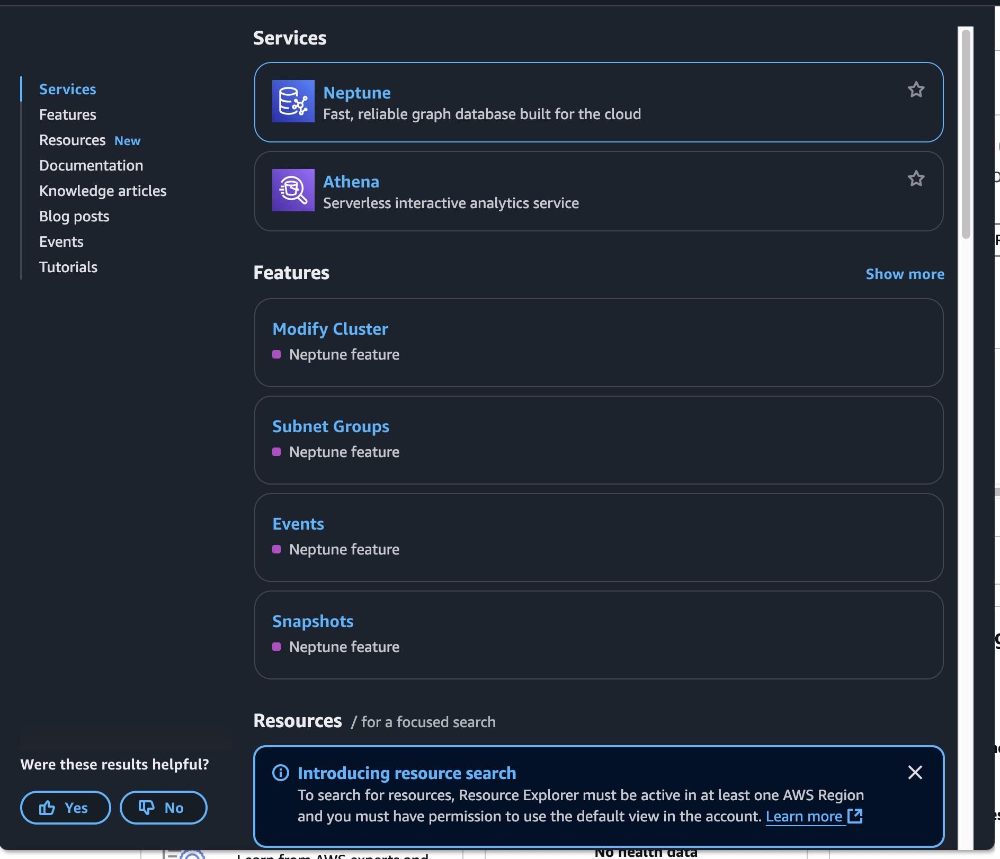
   *Figure 1: Navigating to the Neptune console in AWS Management Console*

2. **Access the Notebook Instances section**:
   - In the left navigation panel, click on "Notebooks"

   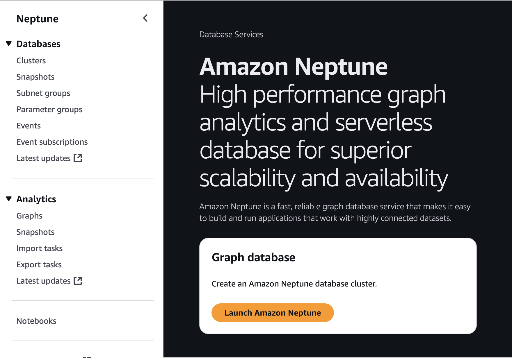
   *Figure 2: Accessing the Notebook instances section in Neptune console*

3. **Create a new notebook instance**:
   - Click the orange "Create notebook" button on top right corner 
   - This will open the notebook instance creation form with several sections
   - The following steps will guide you through filling out each section of this form

   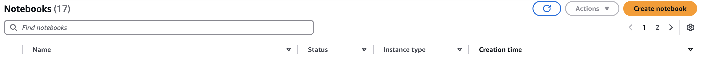
   *Figure 3: Create notebook button in the Neptune console*

4. **Configure the notebook instance**:

   - **Neptune Service Configuration**:
     - Select **Analytics** service 
   
     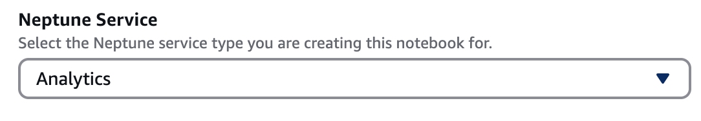
     *Figure 4: Neptune service configuration section*
   
   - **Graph Selection**:
     - Select the specific Neptune Analytics graph you want to work with
     - This graph ID will be automatically configured in your notebook environment
   
     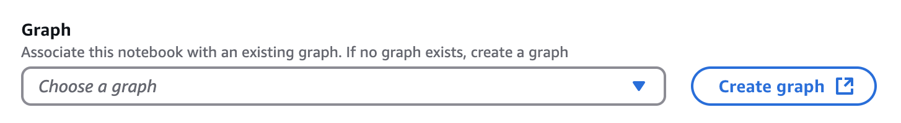
     *Figure 5: Neptune Analytics graph selection*
   
   - **Notebook Instance Type**:
     - Choose an appropriate size based on your workload
       - For testing and development: `ml.t3.medium` is cost-effective
       - For larger graphs or complex algorithms: Consider `ml.t3.xlarge` or larger
   
     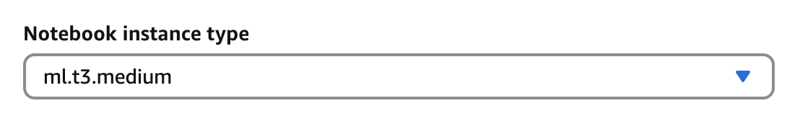
     *Figure 6: Configuring notebook instance settings*
   
   - **IAM Role Configuration**:
     - Select "Create a new role" if you don't have one already configured
     - Ensure the role has these permissions:
       - `neptune-graph:ReadDataViaQuery`
       - `neptune-graph:WriteDataViaQuery`
       - `neptune-graph:DeleteDataViaQuery`
       - `s3:GetObject (for import)`
       - `s3:PutObject (for export)`
       - `s3:ListBucket (for export)`
       - `kms:Decrypt`
       - `kms:GenerateDataKey`
       - `kms:DescribeKey`

     - If using an existing role, verify it has the necessary permissions
   
     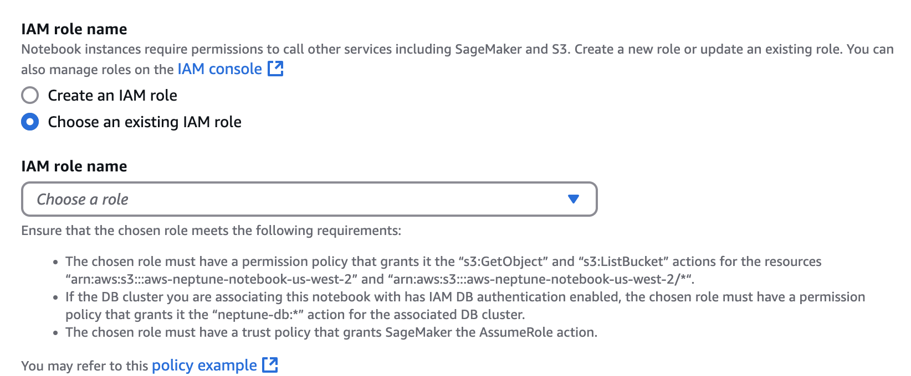
     *Figure 7: IAM role configuration for Neptune notebook*
   
   - **Network Configuration**:
     - VPC: Select the same VPC as your Neptune Analytics instance. 
     - Subnet: Choose a subnet with internet access (for package downloads)
     - Security group: Select or create a security group that allows:
       - Outbound traffic to Neptune Analytics endpoints
       - Inbound traffic on port 443 (HTTPS) for accessing the notebook
     - Direct Connect: Enable if you're connecting from an on-premises network

     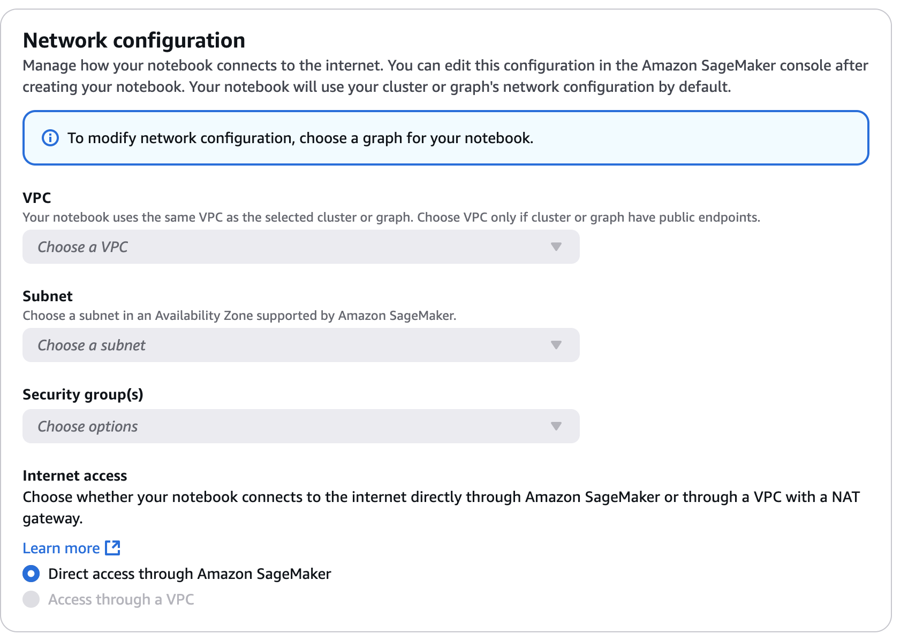
     *Figure 8: Network configuration settings*

5. **Create the instance**:
   - Review your configuration
   - Click "Create notebook" at the bottom of the page

   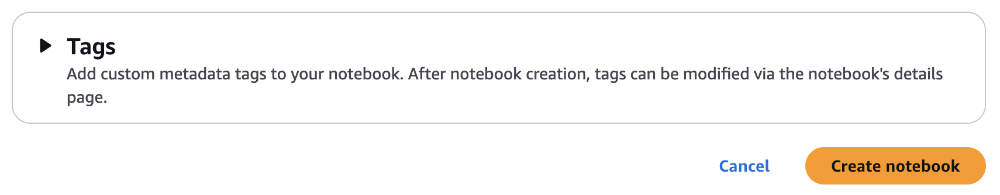
   *Figure 10: Final creation button for the notebook instance*

6. **Wait for provisioning**:
   - The instance status will show as "Pending" while it's being created
   - This typically takes 2-5 minutes
   - When the status changes to "Ready", your notebook is ready to use

   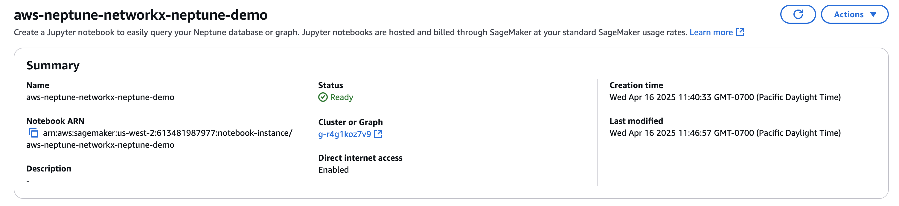
   *Figure 11: Notebook instance status during provisioning*

7. **Access the notebook**:
   - Once the status is "Ready", click "Open JupyterLab"
   - This will open the JupyterLab interface in a new browser tab

   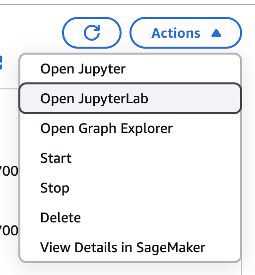
   *Figure 12: Opening the JupyterLab interface*

### Step 2: Prepare the Environment

The nx_neptune package requires Python 3.11 or higher. 
While the default Python version in Neptune notebooks may be lower, 
we'll install Python 3.12 to ensure compatibility and access to the latest features. 
Note that Python 3.11 is the minimum requirement, but Python 3.12 is recommended for optimal performance.

Once your Neptune notebook instance is running:

1. **Upload the package and notebooks**:
   - First, build the wheel file locally:
     ```bash
     cd ./nx-neptune-analytics
     # On your local machine run:
     python -m pip wheel -w dist .
     # creates dist/nx_neptune-0.2.1-py3-none-any.whl
     ```
   - In JupyterLab, use the upload button (↑) in the file browser to upload:
     - The `.whl` file from your local `dist/` directory
     - The notebook files (`pagerank_demo.ipynb` and `bfs_demo.ipynb`)
     
     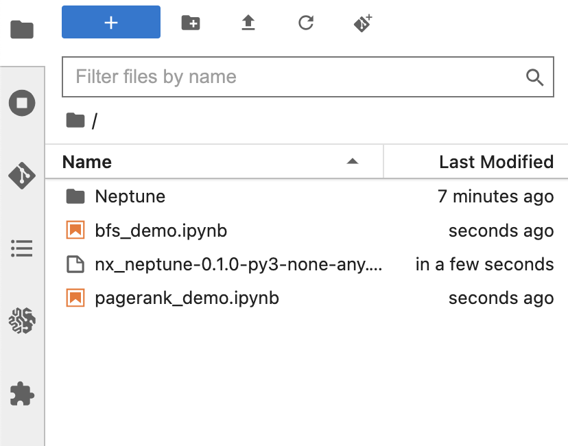
     *Figure 12: Opening the JupyterLab interface*

2. **Upgrade Python version to 3.12 / Install required package **:
   - Open a terminal in JupyterLab (File > New > Terminal)
   - Run the following commands:
     ```bash
     # Check current Python version
     conda create -n python_312 python=3.12.*
     
     # Activate the venv
     source activate python_312 
     
     # Install required packages
     python -m pip install ipykernel jupyterlab matplotlib scipy
     
     # Install the uploaded wheel file
     pip install /home/ec2-user/SageMaker/nx_neptune-0.2.1-py3-none-any.whl
     
     # Verify the installation
     pip list | grep nx-neptune
     
     # Install as bootstrap option
     python -m ipykernel install --user --name python_312 --display-name networkx_312_env
     ```

### Step 3: Run the Examples

1. **Open the uploaded notebooks** in JupyterLab
    
    *Figure 12: Opening the JupyterLab interface*

2. **Select the kernel**:
   - Click on the kernel selector in the top right of the notebook
   - Choose "conda_python_312" kernel
    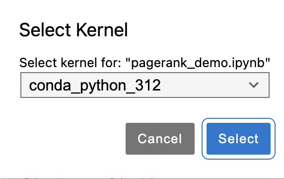
    *Figure 13: Select Python 3.12 kernel*

3. **Set Your Graph ID**:
   - In a notebook cell, set your Neptune Analytics Graph ID:
     ```python
     %env NETWORKX_GRAPH_ID=<your-neptune-analytics-graph-id>
     ```
   - Or you can set it directly in your code:
     ```python
     import os
     os.environ['NETWORKX_GRAPH_ID'] = '<your-neptune-analytics-graph-id>'
     ```

4. **Run the notebook**:
   - Execute the cells sequentially to see the demonstrations

For more information, refer to the [AWS SageMaker Documentation](https://docs.aws.amazon.com/sagemaker/latest/dg/nbi.html) and [AWS Neptune Documentation](https://docs.aws.amazon.com/neptune/latest/userguide/graph-notebooks.html).
